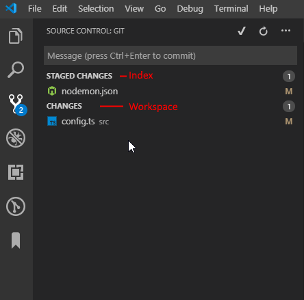

# FileSystem:

**mkdir**-- создать директорию в текущей папке  
**cd** .. --вернуться на одну папку назад  
**cd ./fileName/** -- открыть каталог в текущей директории  
**cd /d/somefolder/anotherFolder** --открыть каталог по абсолютному пути  
**ls** -- выводит список файлов в текущей директории  
**ls -Hidden** -- выводит скрытые файлы в данной дирректории  
**mv ./someDirectory/ ./plaseForIncertion/** -- отправляет одну дирректорию в другую  
**cat /path/** --выводит содержимое указанного файла  
**touch file.txt** -- создает файл в текущей директории  
**rm fle.txt** -- удалить указанный файл  
**type NUL > 1.txt** -- создает файл в данной папке

# Git base comands:



**Workspase ---> Index ----> Repositiry ----> RemoteRepository**  
**git init** -- создать пустой Git репозиторий или реинициализировать сущестыующий  
**git clone URL(or SSH key)** -- клонирует существующий репозиторий с гитхаб на локалку  
**git add .** -- добавить все изменения   
**git status** -- выводит инфу о изменениях в рабочей области  

## Git commit:  

**git commit** -- добавляет изменения в Index  
**git commit -m "Messege"** -- добавляет изменения в индекс с сообщением Messege  
**git commit --author='authorName' --date='dateNow'** -- коммит с указанием фвтора и даты(если он отличается)  
**git commit -a -m "messege"** -- добавляет в индек и сруза комитит с указанным сообщением все изменения в воркспэйс  
**git commit --amend** --изменение последнего комита  
**git commit --amend -m "Новое название"** -- тоже самое  
**git commit --amend --no-edit** -- без редактирование месенджа  
**git show**-- инфа о последнем коммите  
**git show a588** -- инфа о комите с уникальным числом начинающимся с указаннного  
**git log** -- просмотреть историю комитов  
**git log --pretty=oneline** -- посмотреть комиты в строчку  
**git revert a3454...** -- откатываемся к оппределенному коммиту (запушенные изменения)  

## Git config: 

**git config** -- получает или устанавливает глобальные настройки  
**git congig --list** -- список всех глобальных настроек  
**git config --global -e** -- открыть глоб настройки на редактирование  
**git config --global alias.c config** -- test/change:remove .READMY.md"  
**git config core.editor "code --wait"** -- установить по умалчинию в качестве эдитора вскод  
**git config --global --edit** -- открыть на редактирование глобальные настройки   

## Git branch: 

**git branch** -- выводит список бранчей  
**git branch branchName** -- создает новый бранч  
**git branch -d branchname** -- удаляет указанный бранч  
**git branch -m oldname newname** -- переименовать локальный бранч  
**git branch -m newname** -- переименовать текущий локальный бранч  
**git checkout branchName** -- пересесть на указанный бранч  

## Git work with files:  

**git checkout file.txt** -- удаляет изменение только из worckspase  
**git checkout HEAD file.txt** -- удаляет из worckspase **&** индекса изменения указанного файла 

**git reset HEAD file.txt** -- откатываем из индекса добавление file.txt в рабочую зону  
**git reset --soft HEAD^** or  
**git reset --soft HEAD~1** -- отменяем последний комит и оставляем все изменения в индексе  
**git reset --hard HEAD~** -- раскомитить последний комит **изменения комита не вернутся в индекс, пропадут!**   
**git reset --hard ORIG_HEAD** -- откатить ребейз  


## GIT STASH:

**git stash** -- застешеть ченджи  
**git stash save “stash name”** -- засташеть с определенным именем  
**git stash save -u**  
or  
**git stash save --include-untracked** -- застешенть вместе с антрекд файлами  
**git stash list** -- список стешей  
**git stash apply** -- применить последний стеш (0)  
**git stash apply stashId** -- применить стеш с определенным номером  
**git stash clear** -- удалить все стеши  
**git stash drop stashId** -- удалить определенный стеш  

## Git push

**git push origin master** -- пушит на ориджин в ветку мастер  
**git push --force origin HEAD** -- пушит на ориджин перезаписывая то что там есть, тем что есть на локалке в текущую ветку локалки   

## Git other: 

**git remote** -- выводит все origns (ссыла на репозиторий на гитхаб)    
**git merge branchName** -- дополнить данную ветвь изменениями в указанной  
**git rebase branchName** -- дополнить данную ветвь изменениями в указанной   
**git fetch** -- подтягивает инфу с ремоута(если совпадает история комитов на локалке и ремоуте)????    
**git pull origin master** -- мержит и фетчит репозиторий с ремоутом  
**git remote set-url origin git@github.com:vicman-wi/wi-backend.git** -- изменяет юрл ремоута  

# ПЕРЕПИСАТЬ СТАРЫЕ КОМИТЫ:

МОЖНО ДЕЛАТЬ ТОЛЬКО ЕСЛИ ИЗМЕНЕНИЯ НЕ ЗАПУШЕНЫ  
ИНАЧЕ НЕ ЗАПУШИТ БОЛЬШЕ

1. **git rebase -i 28d062bc03428fc4284e561c2ed81c0e68495eed**(id кщмита после которого нам надо переписывать комиты)
2. выбираем что делать с каждым комитом:  
   Commands:

```
# p, pick = оставить без изменений
# r, reword = отредактировать только комитмеседж
# e, edit = добавить изменения к комиту
# s, squash = use commit, but meld into previous commit
# f, fixup = объединить кмиты(указанный с предыдущим, комит меседж оставляет предыдущего комита)
# x, exec = run command (the rest of the line) using shell
# d, drop = удалить комит
```

3. **git rebase --edit-todo** -- отредактировать

https://stackoverflow.com/questions/1967370/git-replacing-lf-with-crlf

# lf && crlf

**git config core.autocrlf **-- выводит текущее состояние  
**git config core.autocrlf true||false||input **--меняет на указанное значение

```
core.autocrlf=true:  core.autocrlf=input: core.autocrlf=false:

        repo                 repo                  repo
      ^      V             ^      V              ^      V
     /        \           /        \            /        \
crlf->lf    lf->crl  crlf->lf       \          /          \
   /            \       /            \        /            \

```

–add autocrlf=false to system-wide gitconfig #per-system solution  
–git config --global core.autocrlf false #per-user solution  
–git config --local core.autocrlf false #per-projectsolution

# Warnings

Vim
**:q!** - выйти не сохраняя  
**:q** - выход  
**:wq**- сохранить и выйти  
**i**- редактировать

**vi .gitconfig** --открыть на редактирование файл в данной дирректории

# WEBPACK

**npm install webpack webpack-cli --save-dev** -- установить в проект  
**npx webpack** -- generate dist/main.js  
**npx webpack --config webpack.config.js** -- создать webpack.config.js  
**npm install --save-dev style-loader css-loader html-webpack-plugin webpack-dev-server** -- загрузить зависимости  
**webpack**
**webpack-dev-server**
**npm install webpack -g**  
**npm install webpack-cli -g**
**npm install -g webpack-dev-server**

# ANGULAR

**ng new my-app** - создать новый проект  
**ng serve --open** - запустить проект и открыть в браузере  
**ng g c other-component** (ng generate component my-component) - сгенерировать новый компонент  
**ng g module module-name** - create new module  
**ng g component module-name/component-name** -- create new component belong to signed module  
**ng g interface module-name/interface-name** -- create new interface inside specific module
